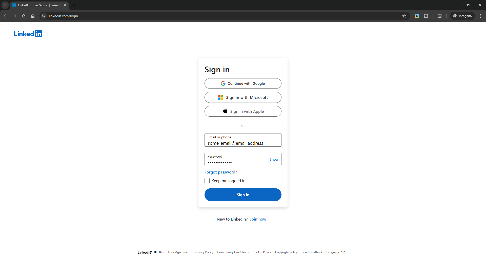
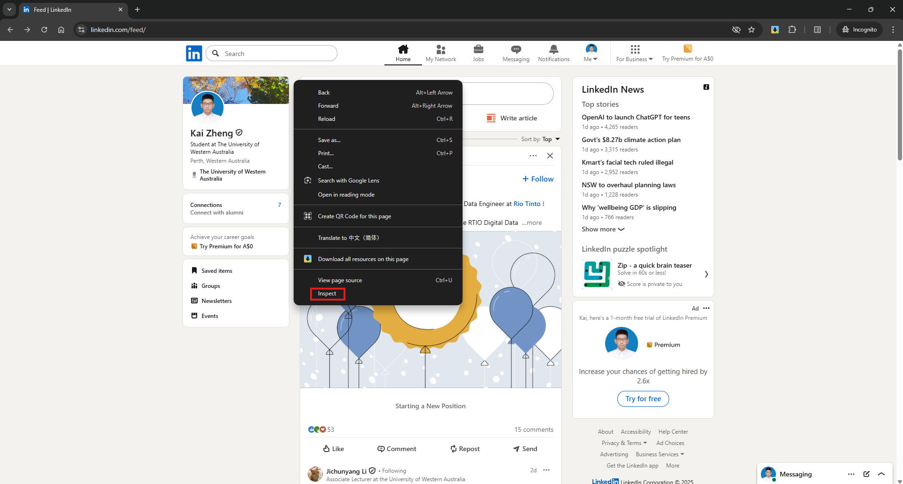

# How to sign in LinkedIn using a cookie

## Step 1 – Sign into [LinkedIn](https://www.linkedin.com/login) in your usual browser

## Step 2 – Open Developer Tools (F12)

Right click and select `Inspect`

## Step 3 – Get `li_at` cookie as credential

1. Switch to `Application` tag
2. Locate cookies created by LinkedIn
3. Copy the value of `li_at` cookie to clipboard

⚠️ Never share your cookie with others — it grants full access to your account

## Step 4 – Configure cookie in you created `.env` file

Paste the copied cookie value after the `=` in the `LI_AT_COOKIE` field.