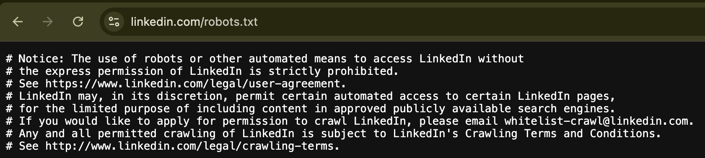

# Client Meeting 13.8

Created: August 9, 2025 12:56 PM
Date: August 13, 2025

Time: 2:30pm

Participants: Lisa, Bella, Everyone in the team

> **Available Fields**
>
> | Required Fields           | Government Directory      | LinkedIn                  |
> | ------------------------- | ------------------------- | ------------------------- |
> | Gender                    |                           | ~~Pronouns~~              |
> | Salutation                |                           |                           |
> | FirstName                 | Name with Salutation      | Name                      |
> | LastName                  |                           |                           |
> | <mark>Organization</mark> | <mark>Organization</mark> | <mark>Organization</mark> |
> | Role                      | Position                  | Position                  |
> | <mark>City</mark>         | <mark>City</mark>         | <mark>Location</mark>     |
> | State                     |                           |                           |
> | Country                   |                           |                           |
> | Business Phone            | Phone                     | ~~Work Phone~~            |
> | Mobile Phone              |                           | ~~Mobile Phone~~          |
> | <mark>EmailAddress</mark> | <mark>Email</mark>        | <mark>Email</mark>        |
> | Sector                    | Section                   |                           |

> **Manually Retrieving**
> 
> 
> How does the client typically find email / phone number information???
> 
> <u>*Didn’t answer directly, i think gov directories and LinkedIn are enough.</u>

**CLIENT**

- Normally know the `FirstName` and `LastName` in input Excel file.
- The **core requirement** is to collect the `EmailAddress`, then are `Organization` and `City`.
    - Mainly use email as a contact method, and hardly use phone
- Not every field has to be covered for each row. (e.g. phone)
- (Low priority) Sometimes use a <u>submission form</u> to send messages on company website

> **Profile Matching**
> 
> 
> Do you have linkedin url of the people you want to search for? Because currently we can only use `name` to search and get the first result. It might be different than the person you want. If you have the exact linkedin url, you can get accurate result
> 

**CLIENT**

- Focus on info matching (search by name+organisation+location(city))
    - Check the company when name is duplicated
    - Mutual connections could be a clue when do manually searching.
    - Work email address can indicate the company for matching.
- They acknowledged that its tricky for a scraper to do so like a human.
- <u>It might be a bit inconvenient to contain the URL field in the input Excel file.</u>

> **Sign-in LinkedIn**
> 
> - The client should be aware of the necessity of logging into their own account
> - Clients need to use their own accounts to login to use the feature

**CLIENT:**

They know that the personal account and password are necessary for LinkedIn scraping

> **Batch Scraping & Frequency**
> 
> - The account will have risks of being banned (50 records per IP, IP will be banned not the account)
> - The client should also be informed of the legal risks of scraping well-protected websites
> - How about a one-by-one scraping button on GUI?
> - Contact LinkedIn for scraping authorization?
> 
> 
> 

**CLIENT:**

- A protective scraping threshold is acceptable.
    - not every time we will update 7000. so should be fine
- **ERICA:** add an alert if updating exceed 50 records

**SENARIO**

A <u>state/federal election</u> will cause batch updates to dozens of rows

- Certain columns will update like ministries, jobs, emails
- Elected people will likely to update their public records to tell the world.

> **Batch Email**
> 
> 
> Do you like batch email to certain `Sector`?
> 

**CLIENT**

- They are a registered not-for-profit charity.
- The <u>Australia Spam Act</u> restricts how to use people’s confidence
    - NOT allowed to subscribe communication without permission
        - but not as strict as European one
    - Public information is allowed to do non-selling businesses
    - Charity could be a exception, which our client is.
        - Their recipient emails are public available emails
- <u>Focus on data cleansing</u>

> **Graphic User Interface**
> 
> 
> Show Figma design and ask for feedbacks
> 

**FEEDBACK:** very good!(we use this)

- One password is enough
- ONLY temporary database needed

> **Email Notification**
> 
> 
> Would you like to ~~get notified about updating results~~ get the exported Excel through email? Because LinkedIn scraper will probably run a few minutes.
> 

**CLIENT:** Yes, please

**Uncategorized Questions & Notes**

- Would you prefer to use government sites if the risks are too high for LinkedIn?
    - Government Directory:
    [https://www.directory.gov.au/commonwealth-entities-and-companies](https://www.directory.gov.au/commonwealth-entities-and-companies)
    - CLIENT: not every time we will update 7000. so should be fine
    - ERICA: add an alert if updating exceed 50 records
- Is the Excel sheet a master copy? Is there an additional database behind this?
    - CLIENT: Excel is good enough
- <u>Alternative solutions:</u>
    1. Scrape profile 1-by-1 when needed, still need to monitor frequency.
    2. Batch scrape with risks.
    3. Alternative data source sites / only government.