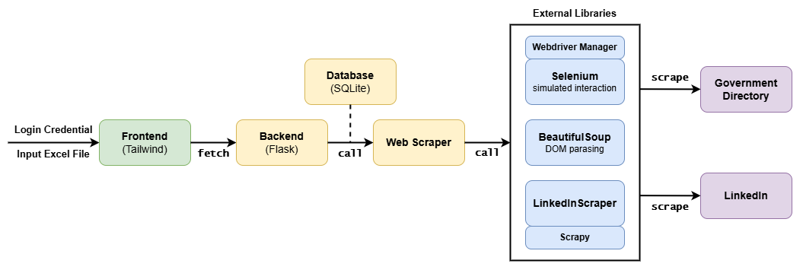

# Week 4 Meeting 13.8

Created: August 2, 2025 9:30 AM
Date: August 13, 2025

## Assumptions/Limitations

- The target profile always ranks first in search result page
- `FirstName` and `LastName` are stable, so the full name can be the primary key.
- `Sector` is an enum type. (see the Sectors tab in sample Excel)
- Anti-scraping
    - LinkedIn does NOT require MFA or Captcha.
    - LinkedIn does NOT change its DOM tree (download html as local file) BeautifulSoup lib
- Sector part is hard to automatically fill in

## Current progress

- Jordan implemented scraping from Government Directory
- Zihan implemented profile_url collection in LinkedIn search result
- implemented profile scraping using `linkedin_scraper`

## Top priority

- The client should be aware of the necessity of logging into their own account when scraping
- The client should also be informed of the legal risks of scraping well-protected websites
- Further authorization may be required to proceed with the project

Did I miss or misunderstanding anything?

Question: