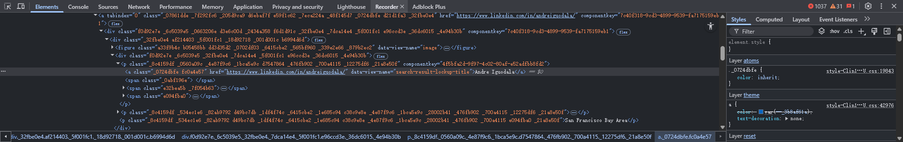

# Week 7 Meeting 10.9

Created: September 7, 2025 10:50 PM
Date: September 10, 2025

> Zihan’s Q&A
> 

Q: Do you have any suggestions on choosing the proxy ip source?

A : I have no suggestions on that, you can choose paid ip pool

Q: How about the cost?

A:  you can talk to the clients to ask if they would like to take it.

Q: What’s the requirements of individual assignment called sofeware features?

A: you should ask bruce

And Qin gave some advice on AI integration to help us find profile url from html.

Focus on cookies expired time. 

> Present database ORM and migration.

> Present frontend login and homepage

> Present data cleansing in `gov_scraper`

> Present cookie login in `linkedin_scraper`

> Present encrypted LinkedIn HTML classes.
> 
> 
> 